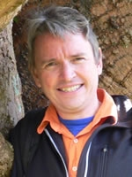

* [Gary Brierley](http://web.env.auckland.ac.nz/people_profiles/brierley_g/) (University of Auckland) - Lead Instructor / Fluvial Geomorphologist

* [Joe Wheaton](http://www.joewheaton.org/Home/) ([Utah State University](http://usu.edu/))- Lead  USU Instructor / Fluvial Geomorphologist
* Nick Bouwes (Utah State University) - USU Instructor / Fisheries Ecologist
* Gary O'Brien (Utah State University) - USU Instructor / Geomorphologist & Geologist

##Primary Instructor Bios

**Gary Brierley **is a river scientist who specializes in the use of science in management applications (especially river rehabilitation and conservation). There has been extensive uptake of a research tool that he co-developed (the River Styles framework ([www.riverstyles.com](http://www.riverstyles.com/)). Professor Brierley's research extends across both scientific and management fields. His primary interest presently lies in the development and application of coherent scientific guidance with which to promote an era of river repair in a manner that respects the inherent diversity and variability of river systems. Key themes for Professor Brierley's research output include: sedimentology, human impacts on river systems, sediment budgets, river management, environmental governance and education. His research has been published in various outlets, including several books, over 70 internationally refereed journal articles, over 20 refereed conference proceedings, over 20 sections in books, various review articles/comments, and over 55 commissioned and/or consultancy reports.

See Gary's [Staff Page](http://web.env.auckland.ac.nz/people_profiles/brierley_g/)

----

**Joe Wheaton** is an Assistant Professor at Utah State University and a fluvial geomorphologist with over a decade of experience in river restoration, including working with beaver in restoration. Joe runs the [Ecogeomorphology & Topographic Analysis Lab](http://etal.joewheaton.org/) at Utah State U. and is a leader in the monitoring and modeling of riverine habitats and watersheds. He is the co-director of the Intermountain Center for River Rehabilitation & Restoration. He worked four years in consulting engineering before completing his B.S. in Hydrology (2003, UC Davis), M.S. and Ph.D. in Hydrologic Sciences (2003, UC Davis; 2008, U. of Southampton, UK). He has worked as a lecturer (U. of Wales 2006-08), Research Assistant Professor (Idaho State U. 2008-09) and is an Assistant Professor at Utah State U. (2009-present) where he teaches GIS, Fluvial Hydraulics and Ecohydraulics.